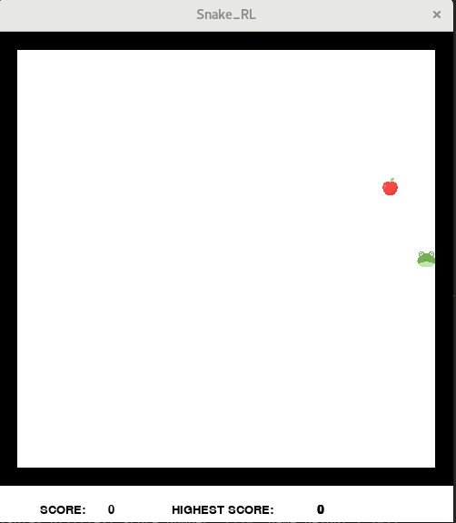
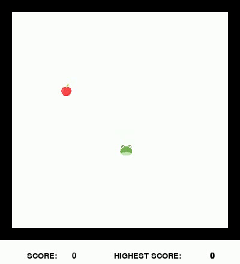
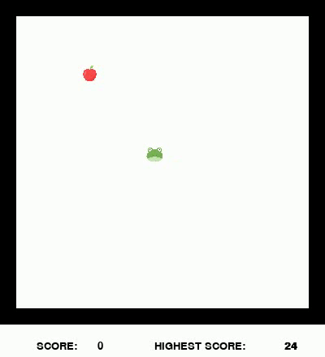
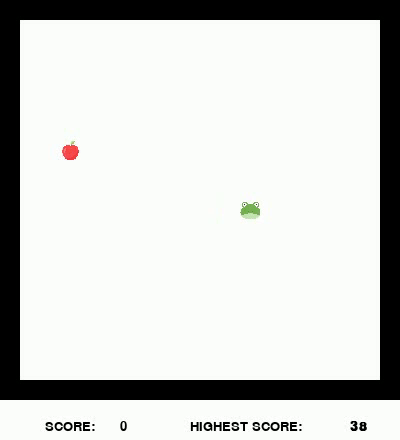
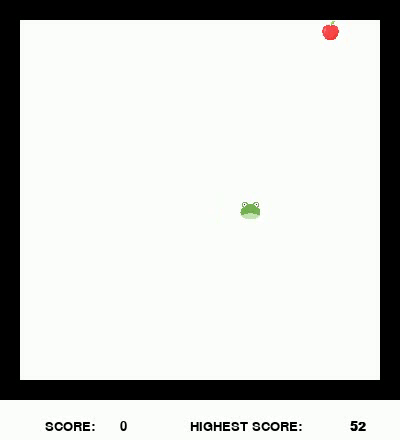

# snake_RL
Snake with reinforcement Learning

# Table of contents 

-  [Requirements](#requirements)  
-  [Snake Game](#Snake)
-  [Training](#Training)
-  [Evaluation](#Evaluation)

## Requirements  

- opencv-contrib-python>=4.4.0.42  
- opencv-python>=4.4.0.42  
- torch>=1.5.0
- torchvision>=0.6.0
- tensorflow-tensorboard>=1.5.1
- numpy>=1.16.4
- pygame>=1.9.6
- tqdm

## Snake 

snake is the classic game of a hungry snake trying to eat apple in the grass. Each time the snake eats an apple, its gets longer. If the snake hits either its body or the walls, it dies and the game ends. 

To play snake call `python snake.py --speed <speed of game>`. Have fun ! 

## Training

If you get tired playing snake yourself,this repo can be used to train a reinforcement learning agent to play snake instead. Maybe it can do better than you ;). The agent is trained using Q-Learning with a deep learning neural network. There are two networks, a Fully connected network and a convolutional neural network. Unfortunately, I couldn't get the CNN to converge :(. 
To train the network call `python train.py` with the following parameters: 

`--show_game` show game visuals?  
`--learning_start LEARNING_START`  memory elements before learning starts, helps by letting the game play out a bit before learning.    
`--batch_size BATCH_SIZE`  batch_size  
`--training_type TRAINING_TYPE`  type of training,(fcn, cnn)  
`--lr LR`  learning rate  
`--gamma GAMMA`  gamma, for balancing near/long term reward  
`--memory_size MEMORY_SIZE`  size of memory  
`--eps EPS`  epsilon, in 'start, end, decay' format  
`--target_update TARGET_UPDATE`  duration before update  
`--features FEATURES`  network layer feature size, in 'f1,f2,f3' format  
`--episodes EPISODES`  number of training episodes  
`--screen_size SCREEN_SIZE`  screen size  
`--block_size BLOCK_SIZE`  game block_size    
`--state_scale STATE_SCALE`  scale of downsized state image  
`--save_interval SAVE_INTERVAL`  interval between saving weights  
`--pretrained PRETRAINED`  pre trained checkpoint  
`--reward REWARD`  reward for eating,dying  
`--output_dir OUTPUT_DIR`  output directory  

With training the agent gets smarter and smarter, using a FCN:

#### Episode 1:  

  

The agent is complete random just wandering around. At the beginning, the agent needs to collect as much info about the environment as possible. 

#### Episode 1000:  

After a thousand episodes, the agent learns to go towards the apple, but it would still do some random moves. 

#### Episode 3000:

 

After three thousand episodes, the agent learns to be more direct in trying to eat the apple. However the agent has problems with loops and will still randomly jitter.  

#### Episode 30000:

  

After 30k episodes. The agent is very good at getting apples but would still struggle with loops, there is very little random jitter now. 

## Evaluation 

Haven't built an eval script yet. WIP. 

 
  

                        

****